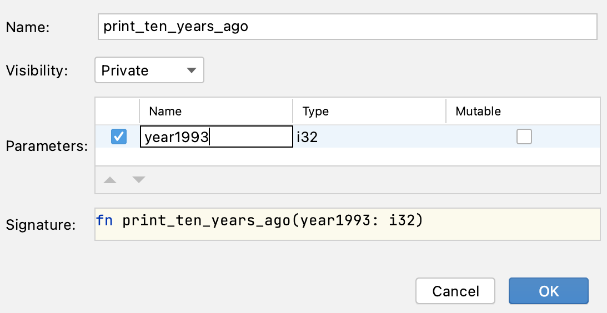

## Maîtriser l'IDE : extraction de méthode de refactorisation

Un développeur a été chargé de modifier le format du message dans le code que vous voyez dans cette tâche.

Au lieu de "1993: 10 years ago was 1983", nous voulons afficher "1993: ten years ago was 1983".

Cependant, dans sa forme actuelle, le développeur doit modifier le message à deux endroits, ce qui deviendrait encore plus gênant lorsque ce code est utilisé dans plusieurs endroits.

Donc, avant de changer effectivement le format du message, le développeur a décidé de procéder à une refactorisation et de créer une fonction qui imprime le message.

### Tâche

**Étape 1 : Créer une Fonction**

Effectuez la refactorisation et créez une nouvelle fonction pour remplacer le code dupliqué.

Sélectionnez la première occurrence de 

```rust
println!("{}: 10 years ago was {}", year1993, year1993 - 10);
```

puis appuyez soit sur &shortcut:ExtractMethod; ou choisissez *Refactoriser -> Extraire Méthode...* dans le menu par clic droit.

Dans la boîte de dialogue qui apparaît, vous pouvez choisir un nom plus approprié pour le paramètre (par exemple, année) :



**Étape 2 : Remplacer le Code Dupliqué**

Après que la nouvelle fonction ait été créée, remplacez la deuxième occurrence du code par le nouvel appel de fonction.

**Étape 3 : Modifier le Texte**

Enfin, changez "10" en "ten" dans le corps de la fonction.