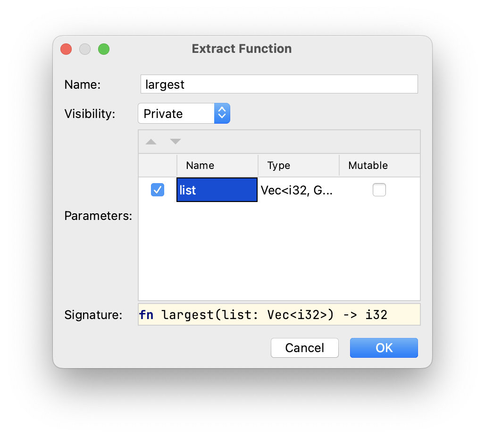

## Éliminer la duplication par des refactorisations

Pour éliminer cette duplication, nous pouvons créer une abstraction en définissant une fonction qui opère sur n'importe quelle liste d'entiers donnée comme paramètre. Cette solution rend notre code plus clair et nous permet d'exprimer le concept de trouver le plus grand nombre dans une liste de manière abstraite.

Nous pouvons atteindre cet objectif en plusieurs étapes en utilisant diverses refactorisations disponibles dans %IDE_NAME%.

### Étape 1 : Extraire une fonction

Notez le premier cadre dans l'éditeur commençant à la ligne 4. Sélectionnez le cadre entier puis appuyez soit sur &shortcut:ExtractMethod; soit choisissez *Refactoriser -> Extraire la méthode...* dans le menu contextuel.

Entrez `largest` comme nom de la fonction et changez le nom du paramètre en `list` comme suit :



Après avoir exécuté cette commande, tout le fragment sera remplacé par la ligne suivante :

```rust
let largest = largest(number_list);
```

Vous verrez également la fonction extraite ci-dessous la fonction `main` :

```rust
fn largest(list: Vec<i32>) -> i32 {
    let mut largest = list[0];

    for number in list {
        if number > largest {
            largest = number;
        }
    }
    largest
}
```

Notez que le code est toujours compilé et s'exécute comme avant avec les mêmes résultats.

### Étape 2 : Renommer une variable

Pour éviter les conflits de noms, renommons quelques variables :

- la première liaison de la variable `largest` (ligne 4) doit être renommée en `result`;
- la deuxième liaison de la variable `largest` doit également être renommée en `result`.

Pour ce faire, vous pouvez soit appuyer sur &shortcut:RenameElement; soit choisir *Refactoriser -> Renommer...* après avoir pointé sur la variable correspondante. Consultez également la [tâche introduisant cette refactorisation](course://Common Programming Concepts/Variables/Introduce Variable Refactoring) si vous rencontrez des difficultés.

### Étape 3 : Remplacer le fragment de code dupliqué

Vous pouvez maintenant sélectionner l'ensemble du quatrième cadre dans l'éditeur et le remplacer par un appel supplémentaire à la fonction `largest`, c'est-à-dire `largest(number_list);`.

À ce moment-là, vous voudrez peut-être aussi retirer le modificateur `mut` pour la deuxième liaison de `result`. Nous n'en avons plus besoin.

### Étape 4 : Ajuster les types

Nous pourrions également vouloir rendre notre paramètre un peu plus général. Pour cela, remplaçons `Vec<i32>` dans la définition de la fonction par une référence à une tranche `&[i32]`. Ce changement introduit plusieurs erreurs de compilation qui peuvent être corrigées en ajoutant `&` aux variables `number_list` lors des appels de la fonction `fn largest` et à la variable `number` dans le en-tête de la boucle `for` à l'intérieur de la définition de la fonction.

Ce changement nous permettrait d'utiliser la même fonction pour des vecteurs, des tableaux, et n'importe quelle tranche de `i32`.