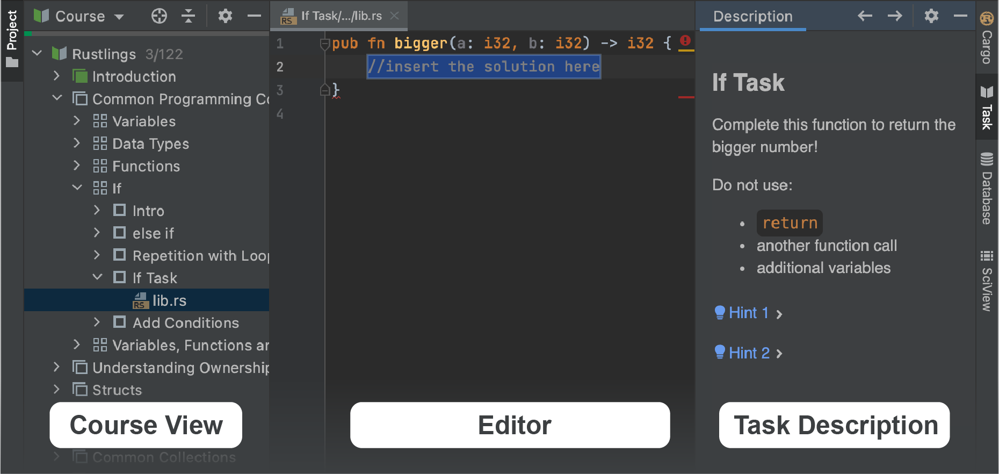

## Aperçu du plugin JetBrains Academy

Cette leçon vous aidera à faire vos premiers pas avec le [plugin JetBrains Academy](https://www.jetbrains.com/help/education/educational-products.html) et à l'utiliser pour apprendre Rust.

Avec le plugin JetBrains Academy, vous pouvez apprendre des langages de programmation et des outils en réalisant des tâches de codage, et obtenir des retours instantanés directement dans l'IDE.

Assez parlé – commençons !

Si vous connaissez déjà l'interface, vous pouvez passer cette leçon.

### Travailler avec des cours
Chaque cours disponible dans JetBrains Academy est structuré comme une liste de leçons. Les leçons, à leur tour, peuvent être regroupées en sections. Chaque leçon contient plusieurs tâches.

Lorsque vous ouvrez un cours, vous verrez les principales fenêtres d'outils utilisées pour la navigation : <b>Vue du cours</b>, <b>Éditeur</b> et <b>Description de la tâche</b> :

Cliquez sur le bouton "Suivant" pour naviguer vers la tâche suivante.