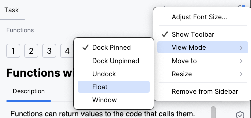

## Description de la tâche

La fenêtre de **Description de la tâche** vous fournit toutes les informations nécessaires pour accomplir une tâche :

Pour les tâches théoriques, la description fournit des matériaux d'apprentissage et de lecture. Pour les quiz, elle propose des questions à choix multiple. Pour les devoirs de programmation, elle expose le problème à résoudre.

Utilisez les éléments de la fenêtre Description de la tâche pour les actions suivantes :

| Élément                                                        | Description                                                                                                      |
|----------------------------------------------------------------|------------------------------------------------------------------------------------------------------------------|
| **Vérifier**                                                  | Vérifiez l'exactitude de votre réponse (pour un quiz) ou de votre solution de code (pour une tâche de programmation) |   
| **Exécuter**                                                  | Exécutez votre code (pour les tâches théoriques)                                          |
|                                          | Aller à la tâche précédente                                                               |    
|  &nbsp;ou **Suivant** | Aller à la tâche suivante                                                                 | 
|                                         | Annuler tous les changements que vous avez faits dans la tâche, et recommencer            | 
|                                   | Laisser un commentaire sur une tâche particulière                                         | 
| <a>Aperçu de la solution...</a>                               | Révéler la réponse correcte et montrer la <b>diff</b>                                    |

Nous recommandons de garder la fenêtre de Description de la tâche visible et de ne pas la cacher complètement. Si elle est trop distrayante, vous pouvez la masquer en cliquant sur le bouton  dans le coin supérieur droit de la fenêtre Description de la tâche.

Si vous utilisez deux moniteurs, il peut être utile de passer le panneau de Description de la tâche en mode flottant et de le déplacer vers le deuxième moniteur, ou de simplement le placer près de la fenêtre principale de l'EDI. Pour ce faire, cliquez sur l'icône des paramètres de la fenêtre d'outils  :

